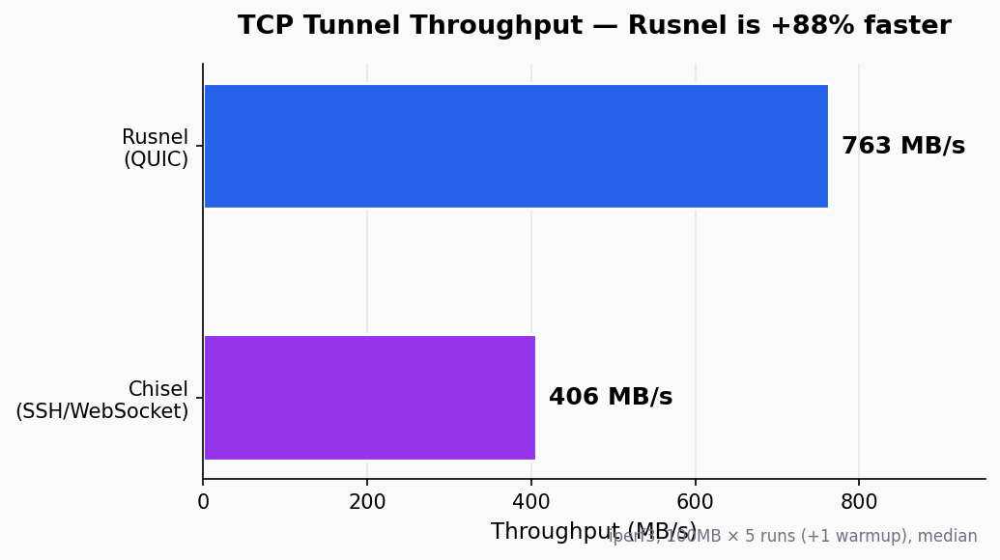
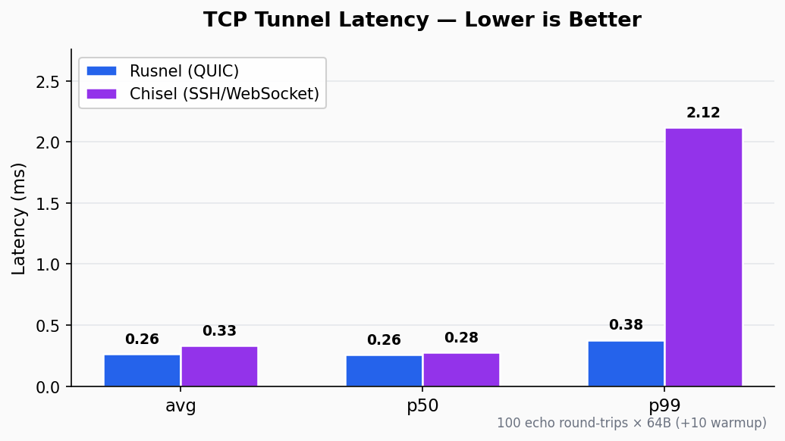
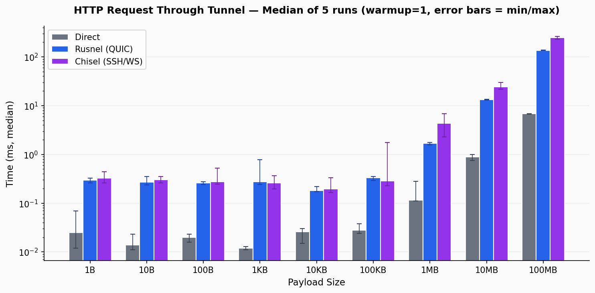

# Rusnel

[](https://crates.io/crates/rusnel)

## Description
Rusnel is a fast TCP/UDP tunnel, transported over and encrypted using QUIC protocol. Single executable including both client and server. Written in Rust.


## Features
-   Easy to use
-   Single executable including both client and server.
-   Uses QUIC protocol for fast and multiplexed communication.
-   Encrypted connections using the QUIC protocol (TLS 1.3).
-   Static forward tunneling (TCP, UDP)
-   Static reverse tunneling (TCP, UDP)
-   Dynamic tunneling (socks5)
-   Dynamic reverse tunneling (reverse socks5)
-   Layered peer authentication: insecure, fingerprint pinning, or full mTLS
    (see [Authentication](#authentication)).


## Install
```bash
cargo install rusnel
```

### or

Clone the repository and build the project:
```bash
git clone https://github.com/guyte149/Rusnel.git
cd rusnel
cargo build --release
```

## Usage
```bash
$ rusnel --help
A fast tcp/udp tunnel

Usage: rusnel <COMMAND>

Commands:
  server  run Rusnel in server mode
  client  run Rusnel in client mode
  cert    generate certificates for use with --tls-* flags
  help    Print this message or the help of the given subcommand(s)

Options:
  -h, --help     Print help
  -V, --version  Print version
```

```bash
$ rusnel server --help
run Rusnel in server mode

Usage: rusnel server [OPTIONS]

Options:
      --host <HOST>          defines Rusnel listening host [default: 0.0.0.0]
  -p, --port <PORT>          defines Rusnel listening port [default: 8080]
      --allow-reverse        Allow clients to specify reverse port forwarding remotes
      --insecure             Disable all TLS authentication (testing only)
      --tls-self-signed      Persisted self-signed cert under --tls-state-dir
      --tls-state-dir <DIR>  Directory for persisted self-signed cert/key (default: ~/.rusnel)
      --tls-cert <PATH>      Server PEM cert (paired with --tls-key)
      --tls-key  <PATH>      Server PEM key  (paired with --tls-cert)
      --tls-ca   <PATH>      Enable mTLS: require client certs signed by this CA
  -v, --verbose              enable verbose logging
      --debug                enable debug logging
  -h, --help                 Print help
```

```bash
$ rusnel client --help
run Rusnel in client mode

Usage: rusnel client [OPTIONS] <SERVER> <remote>...

Arguments:
  <SERVER>     defines the Rusnel server address (in form of host:port)
  <remote>...
               <remote>s are remote connections tunneled through the server, each which come in the form:

                   <local-host>:<local-port>:<remote-host>:<remote-port>/<protocol>

                   ■ local-host defaults to 0.0.0.0 (all interfaces).
                   ■ local-port defaults to remote-port.
                   ■ remote-port is required*.
                   ■ remote-host defaults to 0.0.0.0 (server localhost).
                   ■ protocol defaults to tcp.

               which shares <remote-host>:<remote-port> from the server to the client as <local-host>:<local-port>, or:

                   R:<local-host>:<local-port>:<remote-host>:<remote-port>/<protocol>

               which does reverse port forwarding,
               sharing <remote-host>:<remote-port> from the client to the server\'s <local-host>:<local-port>.

                   example remotes

                       1337
                       example.com:1337
                       1337:google.com:80
                       192.168.1.14:5000:google.com:80
                       socks
                       5000:socks
                       R:2222:localhost:22
                       R:socks
                       R:5000:socks
                       1.1.1.1:53/udp

                   When the Rusnel server has --allow-reverse enabled, remotes can be prefixed with R to denote that they are reversed.

                   Remotes can specify "socks" in place of remote-host and remote-port.
                   The default local host and port for a "socks" remote is 127.0.0.1:1080.


Options:
      --insecure                  Skip server cert verification (testing only)
      --tls-fingerprint <SHA256>  Pin server cert by SHA-256 fingerprint
      --tls-ca <PATH>             Verify server cert against this CA bundle
      --tls-cert <PATH>           Client PEM cert (mTLS; paired with --tls-key + --tls-ca)
      --tls-key  <PATH>           Client PEM key  (mTLS; paired with --tls-cert + --tls-ca)
      --tls-server-name <NAME>    Override SNI / verification name
  -v, --verbose                   enable verbose logging
      --debug                     enable debug logging
  -h, --help                      Print help
```

## Performance

Rusnel (QUIC) vs [Chisel](https://github.com/jpillora/chisel) (SSH-over-WebSocket)
on loopback. Throughput is iperf3 over a tunneled TCP forward
(100 MB × 5 runs + warmup, median); latency is the round-trip time of a
64 B echo across the tunnel.




End-to-end HTTP request times through the tunnel across payload sizes
(median of 5 runs, error bars show min/max):



The benchmark harness also includes a `wan` profile that applies
`tc qdisc netem delay 25ms` to the loopback interface to approximate a
50 ms-RTT WAN. Reproduce everything with `./benchmark/run.sh`
(requires Docker; needs `--cap-add=NET_ADMIN` for netem profiles, which
the script adds for you). See [`benchmark/`](benchmark/) for tunables.

## Authentication

Both the server and the client require an explicit TLS-mode flag — there is
no silent insecure default. Three modes:

| Mode               | Server                                            | Client                                                     |
|--------------------|---------------------------------------------------|------------------------------------------------------------|
| Insecure           | `--insecure`                                      | `--insecure`                                               |
| Fingerprint pin    | `--tls-self-signed` (or `--tls-cert`/`--tls-key`) | `--tls-fingerprint sha256:...`                             |
| Full mTLS          | `--tls-cert ... --tls-key ... --tls-ca ...`       | `--tls-ca ... --tls-cert ... --tls-key ... [--tls-server-name ...]` |

Quickest path for a private/single-user setup — the server logs its
fingerprint at startup, the client pins it:

```bash
rusnel server --tls-self-signed
# server cert fingerprint: sha256:abcd...
rusnel client --tls-fingerprint sha256:abcd... 1.2.3.4:8080 1337
```

For full mTLS, generate a CA + server + client cert (no `openssl` required):

```bash
scripts/gen-certs.sh ./pki 1.2.3.4
rusnel server --tls-ca   ./pki/ca.pem --tls-cert ./pki/server.pem --tls-key ./pki/server.key
rusnel client --tls-ca   ./pki/ca.pem --tls-cert ./pki/client.pem --tls-key ./pki/client.key \
              --tls-server-name 1.2.3.4 1.2.3.4:8080 1337
```

`rusnel cert --help` lists the underlying subcommands (`ca`, `server`,
`client`, `fingerprint`) for finer control. Pre-configured binaries with
credentials baked in at compile time are also supported via
`RUSNEL_EMBED_*` env vars — see `build.rs` and the
[CHANGELOG](CHANGELOG.md) for details.

## TODO
- [x] write tests in rust for tcp, udp, reverse and socks
- [x] improve logging by for each tunnel
- [x] add server tls certificate verification
- [x] add mutual tls verification
- [x] disguise traffic as HTTP/3 to bypass DPI firewalls (ALPN `h3`, default UDP/443, configurable SNI, RFC 9000 QUIC version, optionally CA-signed cert and minimal HTTP/3 facade for active probes)
- [ ] benchmark performance against chisel (and other tunnel tools, e.g. wstunnel, frp)
- [ ] client reconnect
- [ ] add proxy support for client (client connects to server through a proxy)
- [ ] support UDP over SOCKS5 (UDP ASSOCIATE — currently only CONNECT/TCP is implemented)
- [ ] add fake-beckend http/3 feature to server
